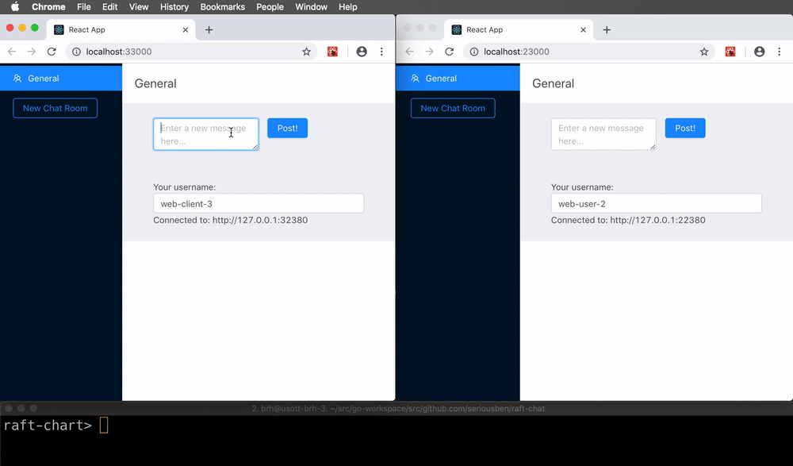

# raft-chat

raft-chat is an highly-available chat server not requiring any databases. It is backed by the [Raft][raft] consensus algorithm.

[raft]: http://raftconsensus.github.io/

# Features

- [x] No database required
- [x] Rooms and Messages
- [x] Unlimited retention of messages 
- [x] Basic Web client
- [x] REST API support
- [x] Websocket support
- [x] Easy to backup (file only)
- [ ] Support non-voting followers
- [ ] Identity and Login support
- [ ] Pagination (of messages and rooms)
- [ ] Websocket robustness (ping/ping and reconnections)
- [ ] Limit persistence of rooms and messages
- [ ] Truncate empty rooms




# Getting Started

## Running single node raft-chat

First start a single-member cluster of raft-chat:

```sh
raft-chat --id 1 --cluster http://127.0.0.1:12379 --port 12380
```

Each raft-chat process maintains a single raft instance and a chat server.
The process's list of comma separated peers (--cluster), its raft ID index into the peer list (--id), and http API server port (--port) are passed through the command line.

Next, post a message ("hello") to a room ("general"):

```
curl -L http://127.0.0.1:12380/rooms/general -d '{"Message": "hello", "User": "username"}'
```

Next, retrieve the stored messages of a room:

```
curl -L http://127.0.0.1:12380/rooms/general
```

Finally, retrieve the list of rooms:

```
curl -L http://127.0.0.1:12380/rooms
```

## Running a local cluster

This will bring up three raft-chat instances.

```sh
raft-chat --id 1 --cluster http://127.0.0.1:12379,http://127.0.0.1:22379,http://127.0.0.1:32379 --port 12380
raft-chat --id 2 --cluster http://127.0.0.1:12379,http://127.0.0.1:22379,http://127.0.0.1:32379 --port 22380
raft-chat --id 3 --cluster http://127.0.0.1:12379,http://127.0.0.1:22379,http://127.0.0.1:32379 --port 32380
```

Now it's possible to send messages to  any member of the cluster and likewise retrieve it from any member.

### Fault Tolerance

To test cluster recovery, first start a cluster and write a message  "foo" to room "general":

```sh
curl -L http://127.0.0.1:12380/rooms/general -d '{"Message": "foo", "User": "username"}'
```

Next, remove a node and add another message  with "bar" to check cluster availability:

```sh
# stop node 1
curl -L http://127.0.0.1:22380/rooms/general -d '{"Message": "bar", "User": "username"}'
```

Finally, bring the node back up and verify it has a "general" chat room with the "bar" message:

```sh
# start node 1
curl -L http://127.0.0.1:12380/general
```

### Dynamic cluster reconfiguration

Nodes can be added to or removed from a running cluster using requests to the REST API.

For example, suppose we have a 3-node cluster that was started with the commands:
```sh
# start node 1
raft-chat --id 1 --cluster http://127.0.0.1:12379,http://127.0.0.1:22379,http://127.0.0.1:32379 --port 12380
raft-chat --id 2 --cluster http://127.0.0.1:12379,http://127.0.0.1:22379,http://127.0.0.1:32379 --port 22380
raft-chat --id 3 --cluster http://127.0.0.1:12379,http://127.0.0.1:22379,http://127.0.0.1:32379 --port 32380
```

A fourth node with ID 4 can be added by issuing a POST:
```sh
curl -L http://127.0.0.1:12380/raft/4 -d http://127.0.0.1:42379
```

Then the new node can be started as the others were, using the --join option:
```sh
raft-chat --id 4 --cluster http://127.0.0.1:12379,http://127.0.0.1:22379,http://127.0.0.1:32379,http://127.0.0.1:42379 --port 42380 --join
```

The new node should join the cluster and be able to service chat requests.

We can remove a node using a DELETE request:
```sh
curl -L http://127.0.0.1:12380/raft/3 -X DELETE
```

Node 3 should shut itself down once the cluster has processed this request.
